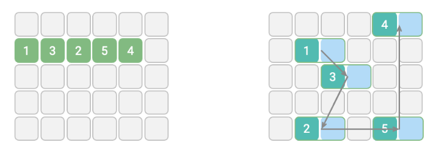

# 01_Data Structures

## Definition

A data structure is a framework or container for organizing and managing data in computer memory (RAM).

## Core Purposes

- Data storage
- Data retrieval
- Data manipulation
- Optimization of algorithmic efficiency (speed and memory)

## Real-World Applications

- **Stack** - Browser History, Undo/Redo functionality
- **Queue** - Task scheduling and Handling requests.
- **Graph** - Represents cities in maps.

## Key Components

- **Data Representation** – How the data will be stored (e.g., arrays, nodes, pointers).
- **Access Patterns** – How data is accessed (e.g., sequential, random).
- **Operations** – Available operations (e.g., insert, delete, search, update).
- **Time complexity** and **Space complexity** for each operation.

## **Classification**

1. **Physical structure** - The way data is stored in computer memory.
    
    **Contiguous Data Structures**
    
    - Elements are stored in adjacent memory locations.
    - **Examples** - Arrays and Strings.
    
    **Non-Contiguous Data Structures**
    
    - Elements are stored in scattered memory locations, with pointers connecting them.
    - **Examples**: Linked Lists, Trees, and Graphs.
    
    
    

1. **Logical structure** - Relationship between data elements.
    
    **Linear Data Structures**
    
    - Data Structure that satisfies the **Linearity** property.
    - Linearity in data structures refers to the arrangement of elements in a linear order (one after the other).
    - Each element has one previous and next element except the first and last.
    - **Advantage** - Easy to implement and traversal.
    - **Example** - Array, Linked List, Stack, and Queue.
    
    **Non-Linear Data Structures**
    
    - Data Structures that do **not** satisfy the Linearity property.
    - Elements are arranged in a hierarchical manner (Tree) or a network-like structure (more than one dimension).
    - Each element can have multiple predecessors or successors (multiple connections).
    - **Advantage** - Better representation of real-world relationships and more efficient for specific operations.
    - **Examples** - Trees, Graphs, Heaps, and Hash Tables.
    
    **Characteristics**:
    
    - Data can be accessed through multiple paths.
    - Memory utilization can be more complex.
    
    
    
    
    

## Properties of Data Structures

### Linearity

- Refers to the sequential arrangement of elements
- **Examples:** Arrays, linked lists where elements form a sequence

**Impacts**

- Simplifies traversal and easy to implement.
- Limited in representing complex relationships

### **Memory Allocation**

- Refers to how data structure elements are stored in memory
- **Examples:** Arrays (static), linked lists (dynamic)

**Impacts**

- Influences scalability of the data structure

### Connectivity

- Refers to how elements are linked or connected within the data structure
- **Examples:** Singly linked lists (unidirectional), doubly linked lists (bidirectional)

**Impacts**

- Determines traversal possibilities and relationship complexity
- It affects memory overhead due to the storage of connection information

### Cyclic

- Refers to whether the data structure contains cycles or loops in its connections
- A cycle exists when you can traverse through elements and return to a starting point
- **Examples:** Circular linked lists, cyclic graphs

**Impacts**

- This can lead to infinite loops if not handled properly in implementations

### Priority

- Refers to the ordering of elements based on their importance or value
- Elements with higher priority are processed or accessed before lower-priority elements
- **Examples:** Priority queues, heap data structures

**Impacts**

- Enables efficient handling of tasks based on importance
- Useful in scheduling and resource allocation systems

### Ordering

- Refers to how elements are arranged within the data structure
- **Examples:** Sorted arrays, binary search trees (ordered), hash tables (unordered)

**Impacts**

- Ordered structures - faster search but slower insertion.

### Uniqueness

- Refers to whether duplicate elements are allowed within the data structure
- **Examples:** Sets (unique), multisets/bags (non-unique)

**Impacts**

- Affects data integrity and storage efficiency

### Indexing

- Refers to the ability to directly access elements using a key or position
- **Examples:** Arrays (index-based), hash tables (key-based)

**Impacts**

- fast retrieval of elements
- May require additional memory to maintain index structures