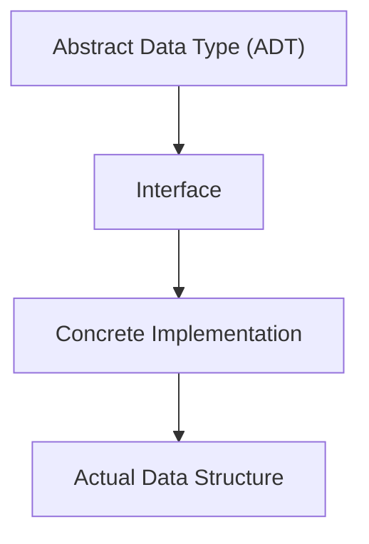

# 03_Abstract Data Types and Implementation

## Abstract Data Type (ADT)

Describe **what the Data Structure does** - its behavior and operations, without specifying how it's implemented.

**Example**:

<aside>
**Stack ADT Example:**
- Operations: push(), pop(), peek(), isEmpty()
- Behavior: Last-In-First-Out (LIFO)
- No implementation details specified

</aside>

## Interface

- It is a contract that specifies the operations of a DS and how to interact with it.
- Provides the methods/APIs to interact with the DS.

**Example**:

<aside>
**List Interface Example:**
- Operations: remove() and insert()
- Provides API methods to manipulate list data

</aside>

## Data Structure (DS)

- The concrete implementation of an ADT using specific programming constructs.
- It provides the actual storage and behavior as defined by the ADT.

**Example**:

<aside>
**Python List:** Implements the List ADT using Dynamic Arrays and exposes the List API.

</aside>

## Relationship

